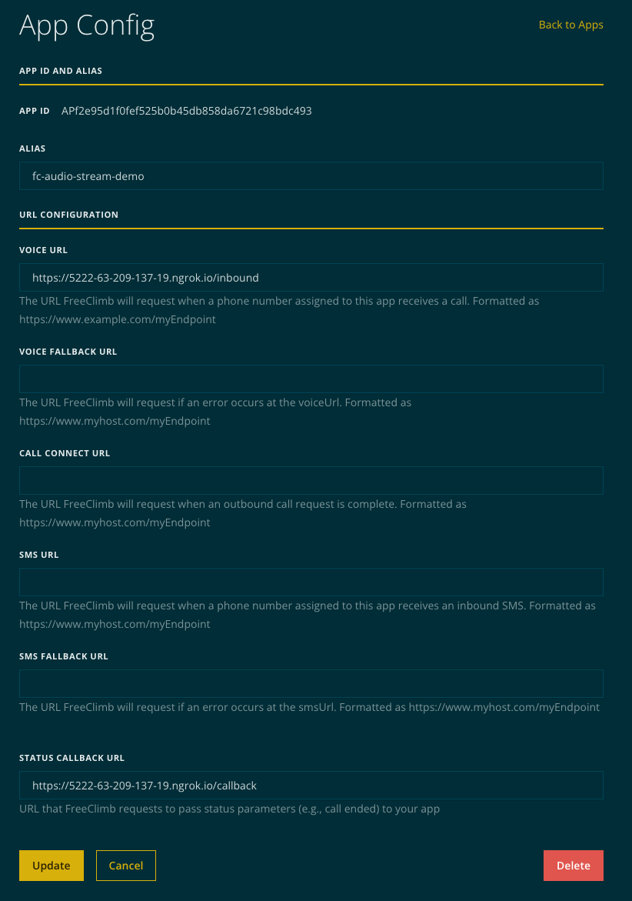
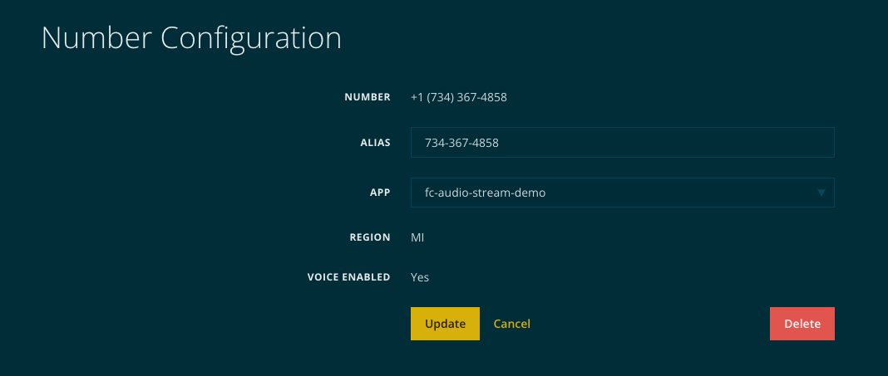

# Demo Application(s)

## Steps for all applications

1. Determine how to expose application
    a. [ngrok](#ngrok) - allows local development but can be limited by firewalls and requires a ngrok account to proxy TCP traffic
    b. [directly](#direct-access) - requires a server and public IP space (or proxy that can handle gRPC/HTTP2)
    
2. Configure FreeClimb application to point at PerCL server
    
3. Purchase and associate number with FreeClimb application
    


## Steps for python example application

1. Run gRPC server component to be exposed

    ```bash
    git clone https://github.com/freeclimbapi/freeclimb-audio-stream-specification
    cd freeclimb-audio-stream-specification/examples/python/server
    ./setup.sh
    ```

2. Configure PerCL server to serve AudioStream PerCL command pointing at gRPC component

    ```bash
    cd freeclimb-audio-stream-specification/examples/python/server
    source venv/bin/activate
    WEBHOOK_HOST=<url for this webserver> AUDIO_STREAM_HOST=<host and port of grpc server> python3 webserver.py
    ```

## Steps for javascript example application

1. Install npm packages
    ```bash
    cd freeclimb-audio-stream-specification/examples/javascript
    npm install
    ```

2. Setup .env file
    ```
    WEBHOOK_HOST=URL
    AUDIO_STREAM_HOST=URL
    gRPC_PORT=50051
    ```
    
2. Start webserver in one terminal instance
    ```bash
    cd freeclimb-audio-stream-specification/examples/javascript
    node server.js
    ```

3. Start gRPC server in another terminal instance
    ```bash
    cd freeclimb-audio-stream-specification/examples/javascript
    node grpcServer.js
    ```

4. Call phone number configured in application. Should see console log messages in grpc server terminal and webserver terminal

## Steps for go example application

1. Install packages
    ```bash
    cd freeclimb-audio-stream-specification/examples/go
    go mod tidy
    ```
    
2. Start webserver in one terminal instance
    ```bash
    cd freeclimb-audio-stream-specification/examples/javascript
    WEBHOOK_HOST=<url for this webserver> AUDIO_STREAM_HOST=<host and port of grpc server> go run main.go
    ```

3. Start gRPC server in another terminal instance
    ```bash
    cd freeclimb-audio-stream-specification/examples/javascript
    go run main.go
    ```

4. Call phone number configured in application. Should see console log messages in grpc server terminal and webserver terminal

## ngrok

1. Configure ngrok with multiple tunnels

    ```bash
    ngrok config edit

    # add these lines
    tunnels:
        grpc:
            proto: tcp
            addr: 50051
        http:
            proto: http
            addr: 5001

    # start the ngrok tunnel
    ngrok start grpc http

    # from the output you will need both tunnels to add to the WEBHOOK_HOST and AUDIO_STREAM_HOST above
    # note that you may need to setup a proxy on a public ip listening on port 443 to forward the GRPC traffic to your local development environment
    ```

## Direct Access

Depends heavily on the environment the applications are being deployed in. This typically will require public IP space, or a proxy that handles HTTP2 traffic, this includes many common open source proxies.
